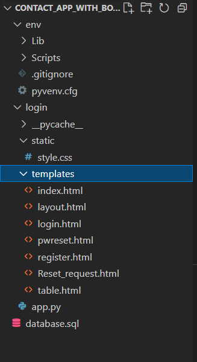

# ContactsApplication
A Contact Management Web Application built using a MySQL Backend database system and a Flask-based front-end system. HTML and CSS scripts were used for styling. The web application can be easily deployed on your localhost and be used to maintain contacts!

STEPS TO RUN THIS PROJECT:

1. Create a project folder in an IDE of your choice. Name the project folder with any name of your choice.
2. Install a virtual python environment by using the following command: py -3 -m venv venv
3. Activate the virtual environment by using the following command: venv\scripts\activate
4. Install Flask within the virtual environment if not already installed: pip install flask
5. Install MySQL workbench to create the backend database: https://dev.mysql.com/downloads/workbench/
6. Now install ‘mysqlbd’ module in your venv: pip install flask-mysqldb
7. Open the mysql workbench and create a new project and add the code present in the "database.sql" file . paste the code and execute it.
8. Now clone this github repository into the project folder.
9. Open a terminal and run this command : flask run
10. This will launch the flask server for the web application
11. Now open up the link: http://127.0.0.1:5000/ in a browser of your choice (preferably google chrome)
12. This will open up the login page in your browser.
13. If you are a new user, click at the sign up link in the bottom and add your details on the "register" page
14. If you are already registered, add your details in the login form and log into the app. this will open the contacts form and the contacts list
15. If you are a registered user , but have forgotten your password, click on the "reset password" link at the bottom. This will launch the reset password page.

Modules completed:
All the four modules have been implemented as per the instructions given.

Functionalities left to be implemented:
A. to implement a function that sends a reset password link to the registered mail id of the user . This can be personalized by using the secret key and hashing it. Due to lack of time , this functionality couldnt be implemented. It could be implemented by using JSON token serializer module in flask.

B. The contacts list needs to be at the bottom of the contacts form and not at the side of it. This needs a bit of resizing of the table and the form as well as some CSS-based positioning. 

C. The reset password background is a bit flawed. This needs to look into as the text is coming out of the box.

Check:

Please check that your project folder looks like this at the end of cloning this repository and installing the python virtual environment:

All other screenshots of the various pages can be found in the "Screenshots" folder!
For any queries on how to run the application: Please add it in Issues or mail me at :syedishahmed99@gmail.com.

